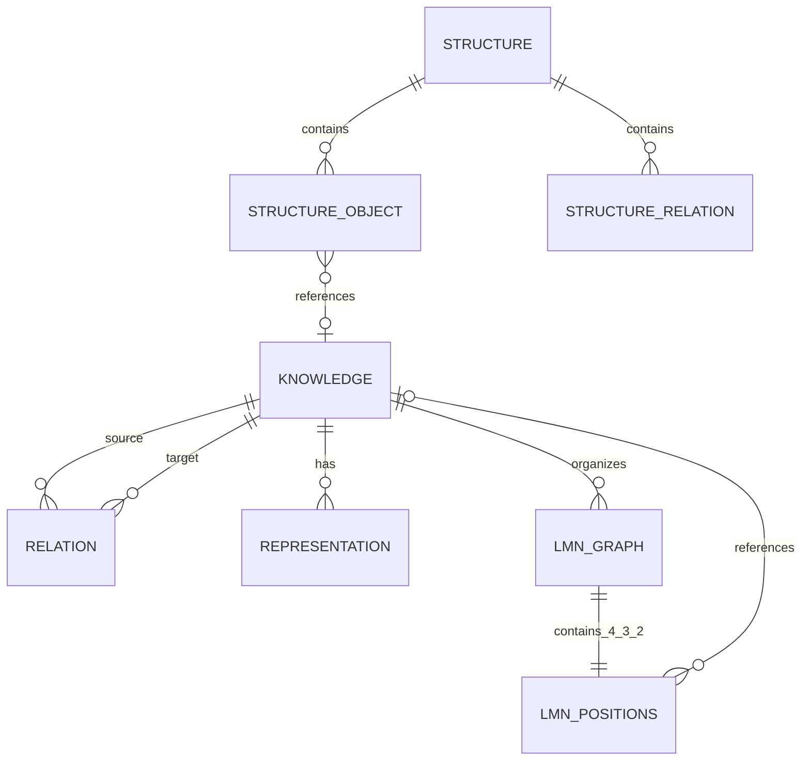

# LMN Architecture Specification

## 1. Formal domain model

`Knowledge(id, title, content, timestamps)` is the stable semantic entity. `Relation(id, sourceId, targetId, type, label)` is persistent and workspace-independent. `Representation` belongs to a Knowledge but never replaces it. `LMNGraph` is one representation with exactly nine typed positions. `Structure` is an independent formal object whose nodes and edges may reference Knowledge.

## 2. Identity and relation rules

- UUID is the only semantic identity; titles are searchable, mutable, and non-unique.
- Selecting an existing Knowledge creates a reference, never a copy.
- Relations remain valid independently of the canvas or representation in which they were created.
- Visual coordinates are presentation state and cannot define a semantic edge.
- Deletion requires dependency review; shared Knowledge is never silently cascade-deleted.

## 3. Representation model

Text, freeform graph, LMN and Structure views are projections over the same identities. Switching views never clones Knowledge. Layout data may be discarded and recomputed without changing meaning.

## 4. LMN schema

Every complete LMN graph contains exactly `L1 L2 L3 L4`, `M1 M2 M3`, and `N1 N2`. Each position is typed and optionally references a global Knowledge UUID. L represents Essence, Existence, Existential and Language; M represents Definition, Constitution and Realization; N represents Intension and Structure. References may recursively lead to other LMNs. Navigation uses bounded local projections and visited sets, so cycles are legal and safe.

## 5. Structure schema

Structures are reusable formal objects: generic directed graph, tree/mind map, or poset. Poset validation requires acyclicity; Hasse derivation uses transitive reduction. Suggestions and conversions require user confirmation and never rewrite underlying Relations silently.

## 6. Persistence and migrations

The shared Web application uses IndexedDB object stores for Knowledge, Relations, Representations, LMNs, Structures and Settings. Versioned `onupgradeneeded` migrations govern database changes. JSON interchange includes `schema_version`; imports validate references and preview impact before a transaction replaces data.

## 7. Offline and sharing strategy

The browser build is a PWA with a service-worker application shell. The Windows executable starts an origin-bound loopback server and serves exactly the same Web and domain packages, so core work remains offline and no cloud service or AI API is required. A future synchronization adapter belongs below repository interfaces; it must preserve UUID identity and expose conflicts instead of last-write-wins data loss.

## 8. Rendering and performance

Graph rendering requests only a bounded neighborhood, uses visited sets and never loads a recursive universe. Stable semantic edges are read from persistence; SVG positions are calculated locally. Larger deployments can replace the layout strategy without touching the domain. Search and neighborhood APIs are the future indexing/cache boundary.

## 9. Testing strategy

Unit tests cover identity, duplicate titles, relation reuse, graph merging, strict LMN positions, recursion/cycles, Hasse reduction, serialization round trips and deletion impact. CI runs tests and produces the Windows artifact. Browser E2E and migration fixtures are the next reliability layer.

## 10. Repository structure

`apps/web` is the shared PWA; `apps/desktop` is the Windows launcher; `packages/domain` contains framework-free rules; `tests` protects invariants; `docs/adr` records irreversible decisions.
